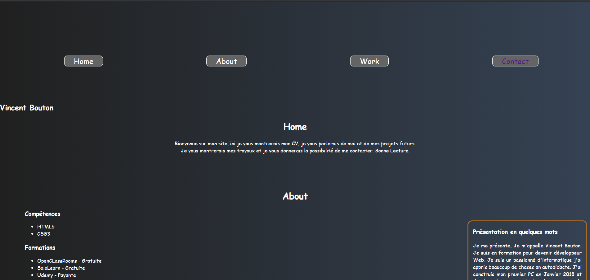

<h1 align="center">Github page</h1>

<!-- Table of content-->

 ## Table of content

* [Overview](#overview)
    * [Built With](#built-with)
    * [Built by](#built-by)
* [Features](#features)
* [Contact](#contact)

## Overview

This repo was created at the very beginning of my learning of the code, it was intended as a portfolio 😂. And to be able to show what I already knew in the code.

I had the transitions and transform them into CSS; it was fun. 👍

### Built with

    
    

    

    
    

    

### Built by

**Vincent-Risk0**

    

